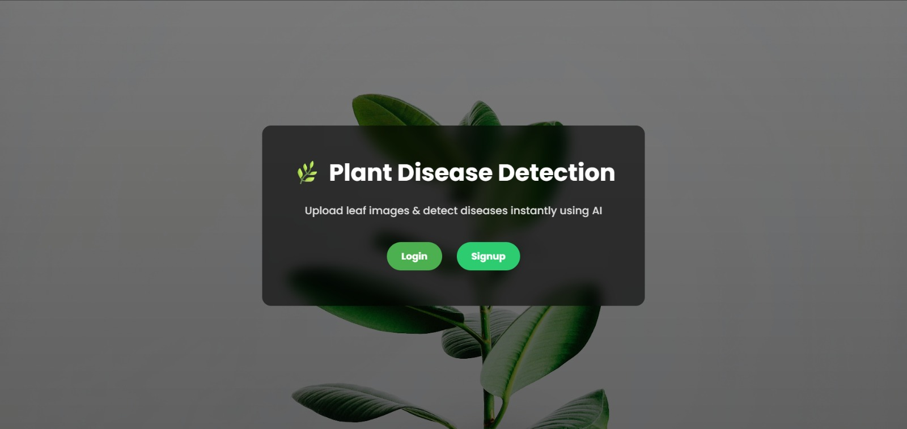
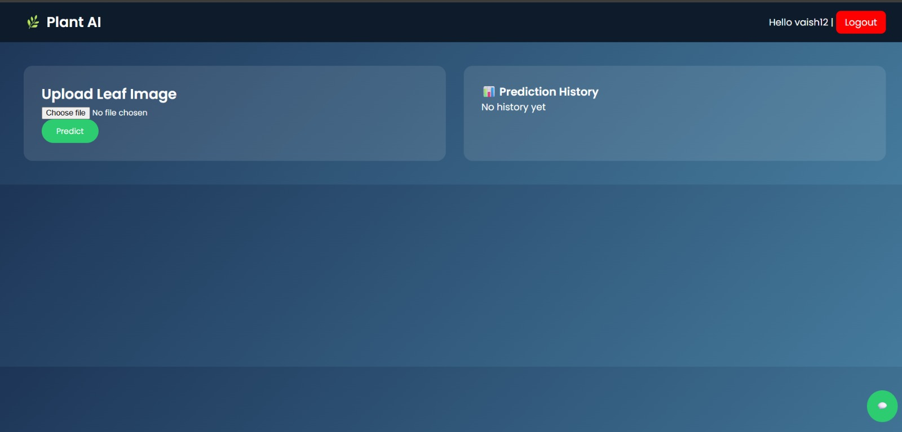
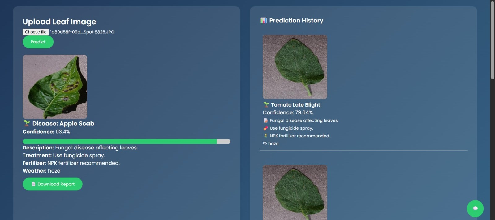
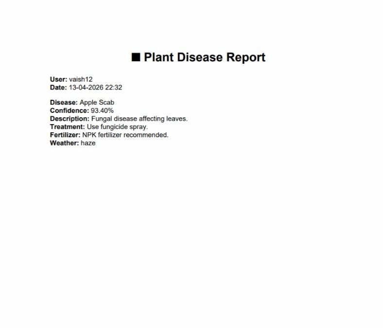

# 🌿 Plant Disease Detection System

A deep learning-based **Plant Disease Detection System** that identifies plant leaf diseases from uploaded images and provides prediction results through a **Flask web application**. The project is designed to support **early disease detection in plants**, helping improve crop monitoring and agricultural productivity.

---

## 📌 Project Overview

Plant diseases can significantly reduce crop quality and yield if they are not detected at an early stage. This project uses **Deep Learning** to automatically classify plant leaf diseases from images and provides the results through a user-friendly web interface.

The system allows users to upload an image of a plant leaf, processes the image using a trained deep learning model, and predicts the disease class along with confidence information. The application is built using **Python, TensorFlow/Keras, Flask, HTML, CSS, and JavaScript**.

---

## 🎯 Objectives

* Detect plant leaf diseases from uploaded images
* Provide quick and accurate disease prediction results
* Build an easy-to-use web application for users
* Support smart agriculture through AI-based disease detection
* Reduce manual effort in identifying plant diseases

---

## ✨ Features

* 📷 **Leaf Image Upload** through web interface
* 🤖 **Deep Learning-based Disease Prediction**
* 📊 **Prediction Confidence Display**
* 🌐 **Flask Web Application**
* 📄 **PDF Report Generation**
* 💬 **Chatbot / AI Assistance support**
* 🌦️ **Weather API integration**
* 🧾 Simple and structured project organization

---

## 🛠️ Tech Stack

### **Programming Language**

* Python

### **Machine Learning / Deep Learning**

* TensorFlow
* Keras
* MobileNetV2 / CNN-based model

### **Web Framework**

* Flask

### **Frontend**

* HTML
* CSS
* JavaScript

### **Other Libraries / Tools**

* NumPy
* OpenCV / PIL
* ReportLab
* Requests
* python-dotenv
* OpenAI API
* Weather API

---

## 📂 Project Structure

```bash
plant_disease_detection/
│
├── model/                 # Saved model files
├── static/                # CSS, JS, images and other static files
├── templates/             # HTML templates for frontend pages
│
├── app.py                 # Main Flask application
├── predict.py            # Disease prediction logic
├── train_model.py        # Model training script
├── evaluate.py           # Model evaluation script
├── report.pdf           # Sample/generated report file
├── .gitignore           # Ignored files for Git
└── README.md            # Project documentation
```

---

## ⚙️ How It Works

1. User opens the web application
2. User uploads a plant leaf image
3. The image is preprocessed and passed to the trained deep learning model
4. The model predicts the plant disease class
5. The prediction result is displayed on the web interface
6. Additional details such as confidence score / report can be shown

---

## 🚀 Installation and Setup

### **1. Clone the Repository**

```bash
git clone https://github.com/vaishnavijayamangala-dev/plant_disease_detection.git
cd plant_disease_detection
```

### **2. Create a Virtual Environment (Optional but Recommended)**

```bash
python -m venv venv
```

### **3. Activate Virtual Environment**

#### **Windows**

```bash
venv\Scripts\activate
```

#### **Mac/Linux**

```bash
source venv/bin/activate
```

---

### **4. Install Required Packages**

If you have a `requirements.txt` file:

```bash
pip install -r requirements.txt
```

If not, install the common dependencies manually:

```bash
pip install flask tensorflow keras numpy pillow requests reportlab python-dotenv openai
```

---

### **5. Create a `.env` file**

Create a file named `.env` in the project root and add your API keys:

```env
SECRET_KEY=your_secret_key
OPENAI_API_KEY=your_openai_api_key
WEATHER_API_KEY=your_weather_api_key
```

> **Note:** Do not upload your `.env` file to GitHub.

---

### **6. Run the Flask Application**

```bash
python app.py
```

The app will run on:

```bash
http://127.0.0.1:5000/
```

Open this URL in your browser.

---

## 🧠 Model Information

The plant disease detection model is trained on plant leaf images to classify diseases.
The project uses a **deep learning approach** (such as **CNN / MobileNetV2**) to extract image features and perform disease classification.

### Model workflow:

* Image input
* Image preprocessing / resizing / normalization
* Feature extraction using deep learning model
* Classification into disease classes
* Prediction result output

---

## 📊 Evaluation

The model can be evaluated using:

* Accuracy
* Precision
* Recall
* F1-Score
* Confusion Matrix
* ROC Curve / AUC

The `evaluate.py` file can be used to test model performance on the validation/test dataset.

---

## 🌐 Web Application Modules

### **1. Home Page**

* Landing page of the application

### **2. Image Upload Module**

* Allows users to upload leaf images

### **3. Prediction Module**

* Sends image to the trained model and returns predicted disease

### **4. Report Generation**

* Generates PDF reports for prediction results

### **5. Chatbot / AI Support**

* Helps users with disease-related assistance or recommendations

### **6. Weather Support**

* Provides weather-related data for agricultural support

---

## 📈 Future Enhancements

* 📱 Real-time plant disease detection using mobile camera
* 🌍 Multilingual chatbot support
* ☁️ Cloud deployment of the application
* 📜 Prediction history and user dashboard
* 🧪 Support for more plant species and disease classes
* 📷 Live leaf detection from real-world images
* 📊 Improved visual analytics and reports

---

## 💡 Use Cases

* Smart agriculture applications
* Farmer support systems
* Plant health monitoring
* Academic deep learning projects
* AI-based crop disease diagnosis

---

## 🔐 Security Note

This project uses API keys for some integrations.
Store sensitive values such as API keys and secret keys in a `.env` file and **never upload them publicly** to GitHub.

---
## 📷 Screenshots

### Login Page


### Upload Page


### Prediction Page


### Report Page


---

## 🤝 Contribution

Contributions, suggestions, and improvements are welcome.
If you would like to improve the project, feel free to fork the repository and create a pull request.

---

## 📜 License

This project is created for **educational and academic purposes**.
You may modify and use it for learning and project development.

---

## 👩‍💻 Author

**Vaishnavi Jayamangala**
GitHub: [vaishnavijayamangala-dev](https://github.com/vaishnavijayamangala-dev)

---

## ⭐ Acknowledgement

This project was developed as part of an academic / minor project to explore the use of **Deep Learning in Agriculture** for automatic plant disease detection.
